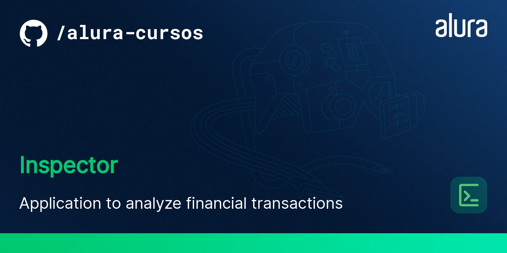

# Project summary

In this project is a web application that to do analyze thousands of financial transactions and identify possible suspicious transactions.

To carry out this analysis, we can upload files through a main screen, which must support files in CSV format, as well as implement algorithms for extracting, validating and persisting information. Good object-oriented practices, design patterns, and SOLID principles are essential. A user CRUD, as well as authentication and authorization mechanisms, will also be developed to secure the application.

# Project features

- [Board Sprint 1](https://trello.com/b/mXvtOwSt/challenge-upload-semana-1)
- [Board Sprint 2](https://trello.com/b/ImfztSDH/challenge-upload-semana-2)

# Techs and Tools

- **Docker**
- **PHP 8**
- **Laravel 8**
- **Composer 2**
- **MySQL 8**
- **PHPStorm or Visual Studio Code**
- **PHP Best practices (PSR's and Clean Code)**
